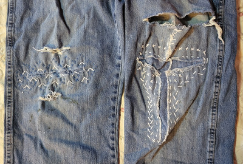
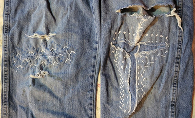
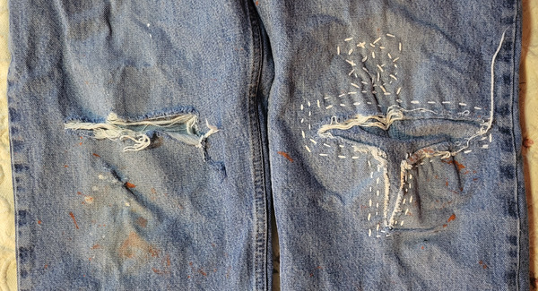
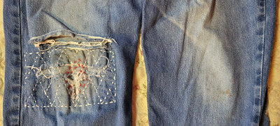
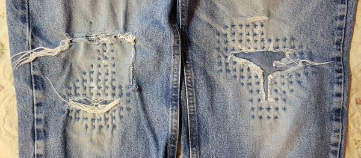

Peter Binkley's sashiko experience.

<h2>The Data</h2>

<table><tbody>
<tr><th>Jeans</th><th>Knee</th><th>Damaged</th><th>Repaired</th><th>Redamaged</th></tr>
<tr><td class="1">1</td><td class="right">right</td><td class="Damaged">Damaged</td><td class="Repaired">Repaired</td><td class="Failed">Failed</td></tr>
<tr><td class="1">1</td><td class="1eft">1eft</td><td class="Damaged">Damaged</td><td class="Repaired">Repaired</td><td class="Failed">Failed</td></tr>
<tr><td class="2">2</td><td class="right">right</td><td class="Damaged">Damaged</td><td class="Repaired">Repaired</td><td class="Held">Held</td></tr>
<tr><td class="2">2</td><td class="1eft">1eft</td><td class="Damaged">Damaged</td><td class="Not_repaired">Not repaired</td><td class="Held">Held</td></tr>
<tr><td class="3">3</td><td class="right">right</td><td class="Damaged">Damaged</td><td class="Not_repaired">Not repaired</td><td class="Held">Held</td></tr>
<tr><td class="3">3</td><td class="1eft">1eft</td><td class="Damaged">Damaged</td><td class="Repaired">Repaired</td><td class="Held">Held</td></tr>
<tr><td class="4">4</td><td class="right">right</td><td class="Damaged">Damaged</td><td class="Repaired">Repaired</td><td class="Failed">Failed</td></tr>
<tr><td class="4">4</td><td class="1eft">1eft</td><td class="No_damage">No damage</td><td class="No_damage">No damage</td><td class="No_damage">No damage</td></tr>
<tr><td class="5">5</td><td class="right">right</td><td class="Damaged">Damaged</td><td class="Repaired">Repaired</td><td class="Failed">Failed</td></tr>
<tr><td class="5">5</td><td class="1eft">1eft</td><td class="Damaged">Damaged</td><td class="Repaired">Repaired</td><td class="Failed">Failed</td></tr>
</tbody></table>

<h2>The Evidence</h2>

